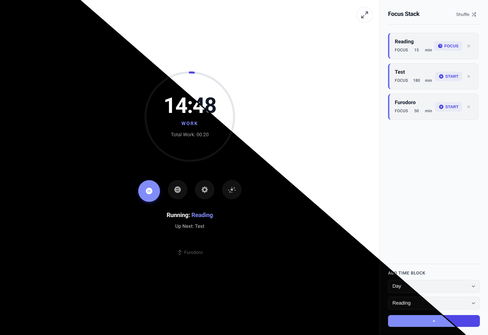
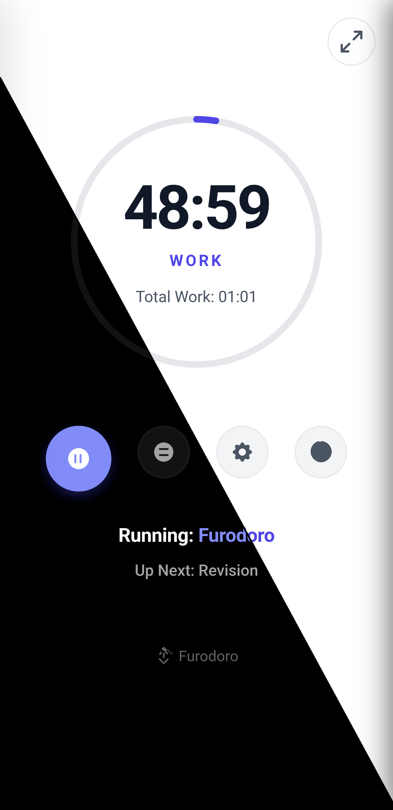
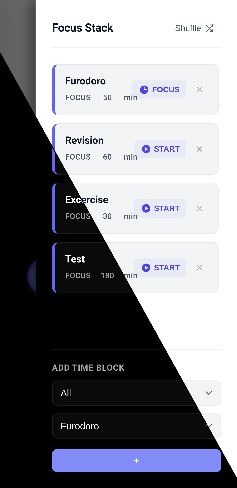

# Furodoro - Pomodoro/Flomodoro Timer with LifeUp Integration

A simple, clean Pomodoro timer web application designed to help you focus, with added integration for tracking completed sessions in the [LifeUp](https://github.com/Ayagikei/LifeUp) gamification app.

  <h3>Desktop</h3>
  

  <h3>Mobile</h3>
  
  

## Features

*   **Classic Pomodoro Timer:** Standard work, short break, and long break cycles.
*   **Flomodoro Timer:** Work in a flow with no restrictions and get proportional break durations.
*   **Task Focus Stack:** Integrated sidebar for managing tasks and categories.
*   **LifeUp Integration:** Automatically logs completed Pomodoro cycles to the LifeUp app via URL scheme.
*   **Configurable Settings:**
    *   Adjust work, short break, and long break durations.
    *   Set custom Work:Rest ratios.
    *   **Dynamic API Configuration:** Configure the LifeUp server URL directly in settings.
*   **Visual Progress:** Circular progress bar visually indicates time remaining.
*   **Mode Indicator:** Clearly shows whether you are in a "Work", "Break", or "Long Break" session.
*   **Stats Display:** Shows total work time accumulated (since last long break/reset) or earned rest time.
*   **Responsive UI:** Optimized for both mobile (with swipeable sidebar) and desktop.
*   **Toast Notifications:** Real-time feedback for API connections and system status.
*   **Dark Mode:** Native AMOLED dark theme with a toggle for light mode.
*   **Security:** Input validation and sanitization for API endpoints.
*   **PWA Ready:** Installable with offline support via Service Worker.

## How to Use

1.  **Prerequisites:**
    *   You need the LifeUp app installed on your device if you want to use the integration feature.
    *   You need the companion local server LifeUp Cloud running (which provides the `/tasks_categories` and `/tasks` endpoints, e.g., at `http://localhost:13276`).
2.  **Add to Furodoro to LifeUp shop:**
    *   First start the LifeUp Cloud Service.
    *   Search Furodoro in World -> Search `Furodoro`-> Market -> Import to add Furudoro to shop OR use [PWA](https://furodoro.pages.dev/). 
3.  **Select Task:** Choose a category and then a specific task from the dropdowns if you want the completed Pomodoro cycle to be logged against that task in LifeUp when you start a long break.
4.  **Start Timer:** Click the play button (▶️) to begin a work session.
5.  **Take Short Breaks:** Click the main button (now showing ⏸️) during a work session to start a short break. The timer will switch to the calculated break duration. Click the main button (now showing ▶️) again during a short break to interrupt it and resume work immediately.
7.  **Take Long Breaks & Log to LifeUp:** After completing one or more work/short break cycles, click the long break button (🟰).
    *   If a task was selected, the app will attempt to redirect to a `lifeup://` URL to log the total work time accumulated since the last long break/reset.
    *   The timer will then switch to the long break duration.
8.  **Adjust Settings:** Click the settings button (⚙️) to open the settings panel and customize timer durations.

## Technologies Used

*   HTML5
*   CSS3 (including CSS Variables / Custom Properties)
*   Vanilla JavaScript (ES6 Modules)

## Future Ideas

- [ ]   Add sound notifications for session completion.
- [x]   Implement the theme toggle button.
- [ ]   Persist selected task across sessions.
- [ ]   Add more robust error handling for API calls.
- [x]   Improve PWA offline capabilities (basic app shell caching implemented).

---

Feel free to contribute or modify!
